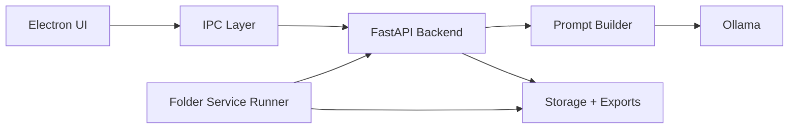

# Megamind Content Studio

<p align="center">
  <strong>Local-first AI studio for turning rough ideas into polished posts and story-driven content.</strong>
</p>

<p align="center">
  Desktop UX when you want to steer. Folder-based service mode when you want the machine to keep moving.
</p>

<p align="center">
  
  
  
  
  
  
</p>

## The Hook

Most AI writing tools stop at "generate text."

Megamind Content Studio is built around a more practical question: what if your local AI stack could behave like a small production studio?

- Research the idea
- Shape the draft
- Reformat it for the target channel
- Run headlessly from a watched folder when you do not want to babysit the UI
- Keep the whole workflow close to your machine and your models

That is the point of this repo.

## GIF Demo

<p align="center">
  
</p>

<p align="center">
  <sub>Replace <code>docs/assets/demo-placeholder.svg</code> with your recorded product GIF when ready.</sub>
</p>

## Why This Project Feels Different

- `Local-first by default` using Ollama instead of outsourcing the core writing loop.
- `Two operating modes` with a guided Electron flow and a folder-driven service runner.
- `Prompt pipeline, not prompt chaos` with a backend that separates raw ideation from platform formatting.
- `Story-friendly direction` through the `storyteller` default model and service job examples for comic-style narrative work.
- `Windows-native practicality` with batch scripts, folder watchers, and service-oriented operation.

## Quick Start

### 1. Install dependencies

```bash
npm install
python -m venv .venv
.venv\Scripts\activate
pip install -r requirements.txt
```

### 2. Configure `.env`

```env
OLLAMA_URL=http://localhost:11434
OLLAMA_MODEL=storyteller
OLLAMA_TIMEOUT=2000
STORAGE_DIR=backend/storage

SERVICE_INPUT_DIR=SERVICE_INPUT
SERVICE_OUTPUT_DIR=SERVICE_OUTPUT
```

### 3. Start the backend

```bash
uvicorn backend.main:app --reload
```

### 4. Start the desktop app

```bash
npm start
```

### 5. Or use the Windows launcher

```bat
run.bat
```

`run.bat` lets you choose between `UI mode` and `Service mode`.

## What It Does Today

### Desktop flow

1. Enter a topic, context, platform, mood, and model in the Electron app.
2. Generate a raw research-style passage through FastAPI.
3. Review and edit the draft.
4. Format the result for a target platform.
5. Export the final output.

### Service flow

1. Drop a text job into the watched input folder.
2. The Python worker claims the file, parses it, and runs the same backend logic without the visible UI.
3. Outputs, manifests, and logs are written to the configured service folders.

## Architecture At A Glance



<details>
<summary><strong>Open the stack breakdown</strong></summary>

### App layers

- `electron/` hosts the desktop shell and IPC bridge.
- `frontend/` contains the screens, styling, and UI controller logic.
- `backend/` contains FastAPI routes, schemas, prompt builders, Ollama integration, and service worker modules.
- `docs/` captures architecture notes and batch-mode guidance.

### Runtime responsibilities

- `Electron` handles the visible workflow.
- `FastAPI` owns the request/response contract.
- `Ollama` generates raw and formatted writing locally.
- `Python worker` powers background folder processing.

</details>

## Folder Service Contract

<details>
<summary><strong>Open service mode details</strong></summary>

### Watched folders

- Input folder: `SERVICE_INPUT`
- Output folder: `SERVICE_OUTPUT`
- Worker base: `backend/storage/service`

### Example job shape

```text
JOB_TYPE: story
TOPIC: The Little Bridge of Courage
MODEL: storyteller
PLATFORM: linkedin
MOOD: Electric
JOB_ID: little-bridge-of-courage

CONTEXT:
Create an 8-panel comic-style story with a gentle, uplifting emotional arc.
```

### Worker entry point

```bash
python -m backend.worker.service_runner
```

Useful docs:

- [Windows Service Batch Mode](./docs/WINDOWS_SERVICE_BATCH_MODE.md)
- [Python Backend Reference](./docs/PYTHON_BACKEND_REFERENCE.md)

</details>

## API Surface

<details>
<summary><strong>Open backend endpoints</strong></summary>

### Health

```http
GET /health
```

### Generate raw draft

```http
POST /generate-raw
```

### Format final post

```http
POST /format-post
```

</details>

## Project Structure

<details>
<summary><strong>Open the repo map</strong></summary>

```text
.
|-- electron/                 Desktop shell and IPC
|-- frontend/                 Screens, styles, and controller logic
|-- backend/
|   |-- core/                 Settings and constants
|   |-- routes/               FastAPI endpoints
|   |-- schemas/              Request models
|   |-- services/             Prompting, Ollama calls, exports, worker helpers
|   |-- worker/               Folder-based background runner
|   `-- storage/              Artifacts, examples, logs
|-- docs/                     Architecture and service docs
|-- run.bat                   Windows launcher
|-- backend.bat               Backend starter
|-- frontend.bat              Frontend starter
`-- folder_service.bat        Folder worker starter
```

</details>


## Current Strengths

- Clean split between generation and formatting stages.
- Easy local experimentation with Ollama models through `.env`.
- Practical batch workflow for Windows users who prefer folders over dashboards.
- Repo already contains story-oriented sample jobs and service examples.

## Current Tradeoffs

- The project is still experimental and evolving quickly.
- Some operational behavior is documented more deeply in `docs/` than in-code.
- A polished product demo GIF still needs to be recorded and dropped into the README.


</details>

## Running Notes

- Default model in `.env`: `storyteller`
- Backend framework: `FastAPI`
- Desktop shell: `Electron`
- Local model runtime: `Ollama`

## License

This repository is currently marked `UNLICENSED`.
